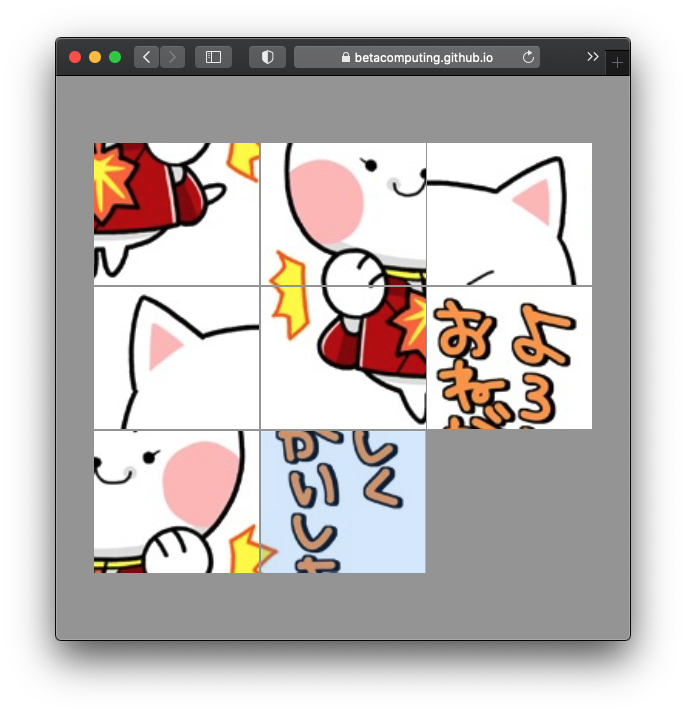

# flutter_puzzle

https://github.com/BetaComputing/flutter_puzzle

https://betacomputing.github.io/flutter_puzzle/

記事: https://blog.betacomputing.co.jp/entry/2021/04/30/164311

## 使用ライブラリ

[使用ライブラリ](LIBRARIES.md)

## コマンド

* 依存関係復元: `flutter pub get`
* build_runner: `flutter pub run build_runner build`
* ビルド: `flutter build web --web-renderer html`
* テスト: `flutter test`
* フォーマット: `flutter format ./`
* 静的解析: `flutter analyze`
